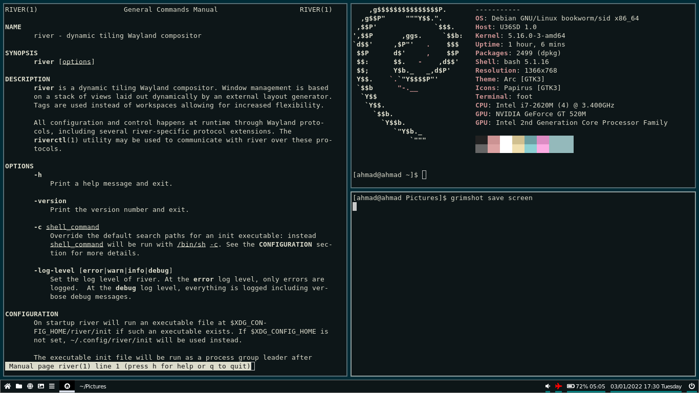

# AGNUSTIC Episode 2

 

## Wayland Compositor : 5 Alternatif Wayland Compositor Non-desktop.

 

### Awalan

Perkembangan wayland dan wayland compositor beberapa tahun belakangan bisa dibilang cukup pesat. terbukti dengan hadirnya beberapa wayland compositor non-desktop / selain GNOME dan KDE, yang bisa dibilang cukup matang untuk digunakan sehari-hari. Berikut setidaknya 5 wayland compositor non-desktop yang mungkin cukup populer di kalangan penggemar wayland compositor.

 

### 5 Alternatif Wayland Compositor Non-desktop.

1. Sway.

- Alternatif dan padanan dari i3.
- Konfigurasi mirip dengan i3.
- Memiliki banyak add-on dan dukungan.

Tangkapan layar Sway :

 

2. River.

- Wayland compositor dinamis.
- Terinspirasi dari dwm dan xmonad.
- Ditulis dalam bahasa pemrograman zig.

Tangkapan layar River :
   

 

3. Hikari.

- Wayland compositor stacking dengan tambahan fitur mirip dengan tiling wm.
- Terinspirasi dari cwm dengan penambahan fitur.
- Berpusat pada keyboard pada penggunaannya.

Tangkapan layar Hikari :

 

4. Labwc.

- Wayland compositor stacking yang mirip dengan openbox.
- Konfigurasi sangat mirip dengan openbox.
- Kompatibel dengan tema openbox.

Tangkapan layar Labwc :

 

5. Dwl.

- Alternatif dan padanan dari dwm.
- Konfigurasi dan instalasi mirip dengan dwm.
- Tersedia beberapa patch yang bisa digunakan.

Tangkapan layar Dwl :

